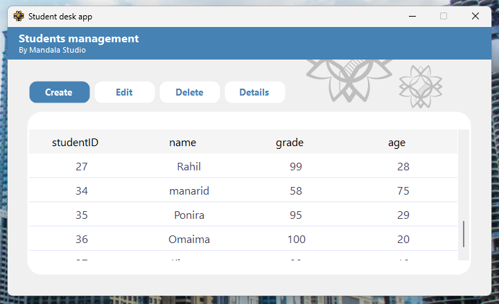

# Student Management System (2025)

This project is a full-stack CRUD application built using modern .NET Core technologies.  
It includes a RESTful Web API (server-side) and a WinForms (.NET Core) desktop client that consumes the API using `HttpClient`.

---

## 🎯 Purpose

Although simple in functionality, this project marked a key shift in my learning journey — transitioning from monolithic, tightly-coupled designs to a **decoupled architecture** based on APIs and DTOs.

It was my **first full-stack application** where:
- The **server** is built with ASP.NET Core + Entity Framework Core + layered architecture.
- The **client** is a desktop application (WinForms on .NET Core) that interacts with the server purely via HTTP.

---

## 🧱 Tech Stack

### 🖥 Server (API)
- ASP.NET Core Web API
- Entity Framework Core (EF Core)
- DTO-based logic separation
- SQL Server (with stored procedures)
- Manual mapping (no AutoMapper)

### 🧑‍💻 Client (Desktop)
- WinForms (.NET Core)
- `HttpClient` for API consumption
- Async/Await-based calls
- Dialog-based UI (Add / Edit / Details)

---
## 🖼️ Screenshots

> 📸 Below are some sample UI screens:

  
  
  

---

## 🧠 Key Learnings

- Designing and exposing clean RESTful APIs using ASP.NET Core.
- Applying layered architecture with clear separation of concerns.
- Building and managing DTOs for structured communication.
- Connecting desktop apps to backend services via API.
- Handling asynchronous operations effectively across layers.

---

## 🪪 Connection to CarJen

> 💡 **This project served as a practical training step** that helped me confidently build a more advanced and production-oriented system:  
> **[CarJen Backend – Modern API for Vehicle Inspection](https://github.com/KhaledAnsar-dev/CarJen-Backend-ASPNetCore-2025)**  
>
> CarJen is a **modern API for vehicle inspection and report management in Algeria’s used car market**, built using the same technologies (ASP.NET Core, EF Core) and follows a layered architecture.  
> It expands on the design and principles practiced in this student system.

---

## 📌 Notes

> This project bridges my earlier experience with desktop applications and my move into modern, scalable, service-based application design.

---

## 🔗 Related Repositories

- [CarJen Backend (2025)](https://github.com/KhaledAnsar-dev/CarJen-Backend-ASPNetCore-2025)

